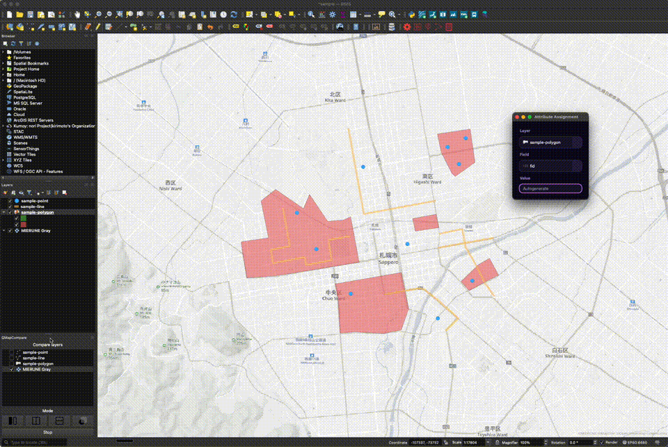

# Attribute Assignment Plugin

Read this in other languages: [Japanese](./README_ja.md)


Easy to assign an attribute on QGIS.

## QGIS Python Plugins Repository

[Attribute Assignment Plugin](https://github.com/dayjournal/qgis-attributeassignment-plugin)  

## blog


## Usage



1. Click "Attribute Assignment".
2. Set "Layer", "Field", and "Value" on the dialog.
3. Click a feature and update the attribute.

## Development

### Requirements

- [uv](https://docs.astral.sh/uv/)
- QGIS 3.x

### Setup

```bash
# Install dependencies
uv sync

# Lint
uv run ruff check .

# Format
uv run ruff format .
```

### Local Development

Create a symbolic link to the QGIS plugins directory:

**macOS:**
```bash
ln -s /path/to/attribute_assignment ~/Library/Application\ Support/QGIS/QGIS3/profiles/default/python/plugins/attribute_assignment
```

**Windows:**
```powershell
mklink /D "%APPDATA%\QGIS\QGIS3\profiles\default\python\plugins\attribute_assignment" "C:\path\to\attribute_assignment"
```

**Linux:**
```bash
ln -s /path/to/attribute_assignment ~/.local/share/QGIS/QGIS3/profiles/default/python/plugins/attribute_assignment
```

After editing the code, reload the plugin in QGIS to see the changes.

## License

Python modules are released under the GNU General Public License v2.0

Copyright (c) 2018-2026 Yasunori Kirimoto
